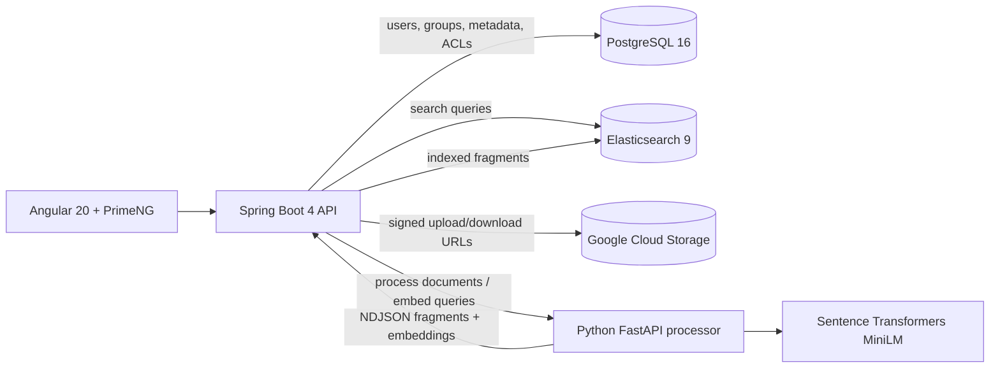

# DocVault

[](https://github.com/Galvin0r/docvault/actions/workflows/ci.yaml)

DocVault is a full-stack document management system built around private libraries,
team sharing, and access-aware search. Users can upload documents, organize access
through groups, preview indexed content, and search across public, owned, and
shared documents with both keyword and vector search.

The project is intentionally production-shaped: it has a Spring Boot API,
Angular client, Python document processor, PostgreSQL metadata store,
Elasticsearch search index, Google Cloud Storage signed uploads, CI, integration
tests, and Playwright end-to-end coverage.

## Highlights

- Account registration, email activation, password reset, Google OAuth login, and
  JWT authentication with HTTP-only cookies.
- Direct-to-storage document upload flow using Google Cloud Storage signed URLs.
- Document ownership, public/private visibility, user-level sharing, and
  group-level sharing.
- Group management with owners, admins, users, public/private/request-only
  visibility, join requests, and member administration.
- Search over accessible documents with keyword queries, highlighting, title and
  author filters, upload date filters, and semantic vector search.
- Asynchronous indexing pipeline with job locking, retries, metadata sync, and
  failure states.
- Python processing service for PDF, DOCX, EPUB, and plain text extraction,
  chunking, and embeddings.
- Automated backend unit/integration tests, frontend unit tests, processor tests,
  and browser E2E tests in GitHub Actions.

## Architecture



Documents are uploaded to GCS first, then the backend schedules an indexing job.
The indexer asks the processor to download the document from a short-lived signed
URL, extract text, split it into chunks, generate embeddings, and stream the
fragments back as NDJSON. The backend enriches each fragment with document
metadata and access-control fields before storing it in Elasticsearch.

## Tech Stack

| Area | Tools |
| --- | --- |
| Frontend | Angular 20, PrimeNG, Tailwind CSS, RxJS, Playwright |
| Backend | Java 21, Spring Boot 4, Spring Security, Spring Data JPA, Spring Data Elasticsearch |
| Processor | Python 3.12, FastAPI, sentence-transformers, PyPDF, python-docx, ebooklib |
| Data | PostgreSQL, Elasticsearch dense vectors, Liquibase migrations |
| Storage | Google Cloud Storage signed URLs |
| Testing | JUnit, Mockito, Testcontainers, Karma/Jasmine, Pytest, Playwright |
| Delivery | Docker, GitHub Actions, GitHub Container Registry |

## Repository Layout

```text
.
|-- backend/     # Spring Boot API, persistence, security, search, indexing jobs
|-- frontend/    # Angular client, UI components, E2E stack and Playwright specs
|-- processor/   # Python document extraction, chunking, embedding service
`-- pom.xml      # Maven multi-module parent
```

## Getting Started

### Prerequisites

- Java 21
- Node.js 24 and npm
- Python 3.12
- Docker and Docker Compose

### Run The Local Demo Stack

The fastest way to try the app locally is the E2E profile. It uses Docker for
PostgreSQL and Elasticsearch, a stub storage client, and stub document
processing, so you do not need GCS credentials.

```bash
cd frontend
docker compose -p docvault-e2e -f e2e/compose.yaml up -d
```

```bash
cd ../backend
./mvnw -B -ntp -DskipTests spring-boot:run \
  -Dspring-boot.run.arguments=--spring.profiles.active=e2e
```

Seed repeatable demo data:

```bash
curl -X POST http://127.0.0.1:8080/api/e2e/reset
```

Start the Angular app:

```bash
cd ../frontend
npm ci
npm start
```

Open `http://localhost:4200`. The seeded users are:

- `alice` / `password123`
- `bob` / `password123`

When you are done:

```bash
cd frontend
docker compose -p docvault-e2e -f e2e/compose.yaml down --remove-orphans
```

The `e2e` Spring profile exposes fixture reset endpoints and is only for local
development and automated tests.

### Run The Real Processor

For full document extraction and vector embeddings, run the processor and start
the backend with `app.processing.mode=http`.

```bash
cd processor
python3 -m venv .venv
source .venv/bin/activate
pip install --index-url https://download.pytorch.org/whl/cpu torch==2.6.0+cpu
pip install -r requirements.txt
uvicorn app.main:app --host 0.0.0.0 --port 8000 --reload
```

The processor exposes:

- `GET /health`
- `POST /process`
- `POST /embed`

## Configuration

The backend uses Spring configuration, so every property can be overridden with
environment variables. Important production settings include:

| Variable | Purpose |
| --- | --- |
| `SPRING_DATASOURCE_URL`, `SPRING_DATASOURCE_USERNAME`, `SPRING_DATASOURCE_PASSWORD` | PostgreSQL connection |
| `SPRING_ELASTICSEARCH_URIS` | Elasticsearch endpoint |
| `APP_SECURITY_SECRETKEY` | JWT signing key |
| `SPRING_MAIL_USERNAME`, `SPRING_MAIL_PASSWORD`, `APP_EMAIL_FROM` | Email delivery for activation and password reset |
| `SPRING_SECURITY_OAUTH2_CLIENT_REGISTRATION_GOOGLE_CLIENT_ID` | Google OAuth client ID |
| `SPRING_SECURITY_OAUTH2_CLIENT_REGISTRATION_GOOGLE_CLIENT_SECRET` | Google OAuth client secret |
| `APP_GCS_CREDENTIALS_LOCATION`, `APP_GCS_BUCKET_NAME` | Google Cloud Storage credentials and bucket |
| `APP_PROCESSING_MODE`, `APP_PROCESSING_HTTP_BASE_URL` | Processor mode and URL |

Do not use checked-in development values for production. Keep real secrets in
environment variables, a private profile, or your deployment platform's secret
store, and rotate any credentials that were ever committed.

## Testing

Backend unit tests:

```bash
cd backend
./mvnw -B -DskipITs=true -Djacoco.skip=true test
```

Backend integration tests with Testcontainers:

```bash
cd backend
./mvnw -B -DskipUnitTests=true -DskipITs=false -Djacoco.skip=true verify
```

Frontend tests and production build:

```bash
cd frontend
npm ci
npm run test:ci
npm run build -- --configuration production
```

End-to-end tests:

```bash
cd frontend
npm run e2e
```

Processor tests:

```bash
cd processor
mvn -B test
```

## API Snapshot

All backend endpoints are served under `/api` in the normal frontend setup.

- `POST /auth/register`, `POST /auth/authenticate`, `POST /auth/activateAccount`
- `POST /auth/resetPassword`, `POST /auth/setNewPassword`
- `GET /accounts`, `PATCH /accounts/change-login`, `POST /accounts/logout`
- `POST /document/draft`, `POST /document/{id}/sign-upload`,
  `POST /document/{id}/complete-upload`
- `GET /document`, `GET /document/search`, `GET /document/{id}`,
  `GET /document/{id}/fragments`
- `PUT /document/{id}/access/users/{userId}`,
  `PUT /document/{id}/access/groups/{groupId}`
- `POST /groups`, `GET /groups`, `GET /groups/{id}`,
  `POST /groups/{id}/members/me`, `POST /groups/requests/{requestId}/accept`

## Deployment

Tag pushes that match `v*` run the release workflow after verifying that the tag
points at `main`. The workflow runs tests, builds production artifacts, and
publishes Docker images to GitHub Container Registry:

- `ghcr.io/galvin0r/docvault-backend`
- `ghcr.io/galvin0r/docvault-frontend`
- `ghcr.io/galvin0r/docvault-processor`

The frontend image serves the Angular build with nginx and proxies `/api` to the
backend container.

## Status

DocVault is a working full-stack MVP with authentication, groups, document
upload, sharing, access-aware search, content previews, async indexing, and CI.
Natural next steps would be richer in-browser document previews, audit logs, and
more deployment hardening.

## License

No license has been added yet.
